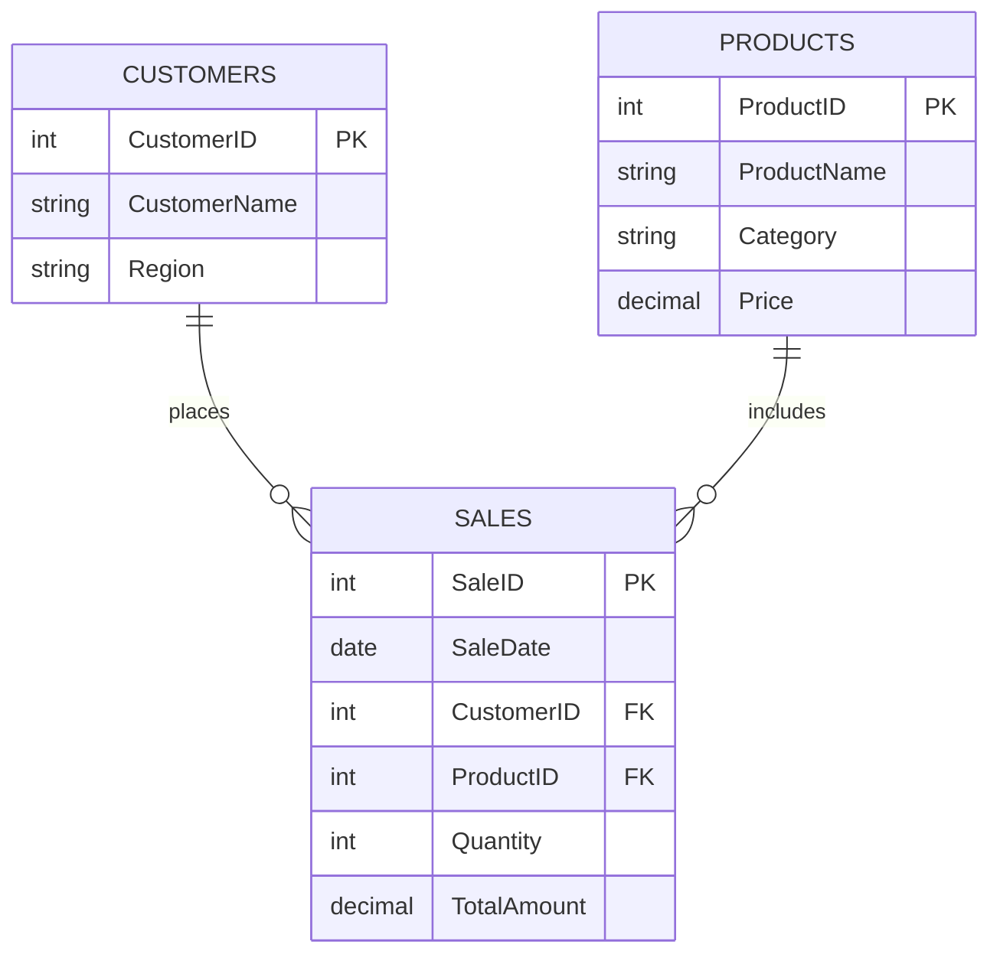

# plsql_window_functions_29216_Ines

## Business Problem

### Business Setting
TechWorld is an electronic goods retail store with branches in the North, South, East, and West territories. The sales department needs deeper data insight into the analysis of revenue trends, customers, and stock.

### Data Difficulty
The business suffers from challenges in determining the product and customer who are not performing to expectation and revenue growth trends over time. With such management, marketing is not yet powerful; neither are the activities in stock reflecting true transparency of the customers' spending habits.

### Anticipated Result
Anticipated Results SQL is defined to provide insight into the following: - Top-selling products per territory - Customers targeted with marketing campaigns based on their spending habits - Monthly sales growth trend analysis - Running total revenue - Inventory that is not selling and customers who are not spending

## Success Criteria
This analysis achieves the following five measurable goals using window functions:

1. **Top Products per Region** → Use `DENSE_RANK()` to identify the top 5 revenue-generating products in every region for inventory prioritization
2. **Running Monthly Sales Totals** → Use `SUM() OVER()` with ORDER BY to calculate cumulative revenue over time
3. **Month-over-Month Growth Analysis** → Use `LAG()` to compare monthly sales and compute growth rates for trend analysis
4. **Customer Quartile Segmentation** → Use `NTILE(4)` to divide customers into Gold, Silver, Bronze, and Basic tiers based on total spending
5. **Multi-Function Ranking** → Demonstrate `ROW_NUMBER()`, `RANK()`, `DENSE_RANK()`, and `PERCENT_RANK()` for comprehensive product performance analysis

## Database Schema

### Tables
1. **Customers** - Stores customer information and regional assignment
2. **Products** - Electronics inventory with pricing
3. **Sales** - Transaction records linking customers to products

### Entity-Relationship Diagram

## Files
- **[queries.sql](queries.sql)** - Complete SQL script with schema, sample data, JOIN queries, and window function implementations

## Key Queries Implemented

### Part A: SQL JOINs
1. **INNER JOIN** - All completed sales with customer and product details
2. **LEFT JOIN** - Identify customers with no purchase history
3. **RIGHT JOIN** - Find products with zero sales activity
4. **FULL OUTER JOIN** - Comprehensive view of all customers, products, and sales
5. **SELF JOIN** - Compare sales within the same region for pricing analysis

### Part B: Window Functions

#### 1. Ranking Functions
- `ROW_NUMBER()`, `RANK()`, `DENSE_RANK()`, `PERCENT_RANK()`
- **Use Case:** Rank products by revenue in each region

#### 2. Aggregate Window Functions
- `SUM()`, `AVG()`, `MIN()`, `MAX()` with ROWS and RANGE frames
- **Use Cases:** Running totals, 3-sale moving averages, trend analysis

#### 3. Navigation Functions
- `LAG()`, `LEAD()`
- **Use Case:** Month-over-month sales growth and percentage calculations

#### 4. Distribution Functions
- `NTILE(4)`, `CUME_DIST()`
- **Use Case:** Customer segmentation into Gold, Silver, Bronze, and Basic tiers

## Results Analysis

### Descriptive Analysis - What Happened?
- **Total Revenue:** $10,712 across 14 transactions from October 2025 through February 2026
- **Regional Performance:** North region shows strong sales with multiple high-value purchases (Gaming Laptops, 4K TVs)
- **Product Categories:** Computers and TV categories generate highest individual transaction values ($1,299-$1,499)
- **Customer Activity:** All 10 registered customers have made at least one purchase, showing 100% activation rate
- **Top Products:** Gaming Laptop G5 and 4K OLED TV 55" lead in revenue generation

### Diagnostic Analysis - Why Did It Happen?
- **Premium Products Drive Revenue:** High-value items (laptops, TVs) account for disproportionate share despite lower unit sales
- **Regional Variation:** North region's performance correlates with purchases of premium electronics
- **Seasonal Patterns:** Sales show consistent activity across months with slight increase in January-February 2026
- **Customer Concentration:** Top quartile (Gold tier) customers contribute significantly more revenue than Basic tier
- **Product Mix:** Balanced sales across Mobile, Audio, TV, and Computer categories indicate diverse customer needs

### Prescriptive Analysis - What Should Be Done?
1. **Inventory Management:** 
   - Increase stock of top-ranked products (Gaming Laptops, 4K TVs) in high-performing regions
   - Consider clearance sales for products with zero activity
   
2. **Customer Targeting:**
   - Create VIP loyalty program for Gold tier customers (top 25% spenders)
   - Launch engagement campaigns for Basic tier to increase average transaction value
   - Offer product bundles combining high-margin items with complementary accessories

3. **Regional Strategy:**
   - Replicate successful North region tactics (premium product focus) in underperforming areas
   - Adjust regional inventory based on local buying patterns revealed by ranking functions

4. **Growth Initiatives:**
   - Address months showing negative growth with targeted promotions
   - Use moving averages to set realistic monthly sales targets
   - Implement cross-selling strategies based on self-join regional purchase patterns

## Key Insights

1. **Window functions enable sophisticated analytics** without complex subqueries or self-joins
2. **Ranking functions identify top performers** at granular levels (per region, per category)
3. **Navigation functions simplify trend analysis** by accessing previous/next rows directly
4. **Distribution functions automate customer segmentation** for personalized marketing
5. **Frame specifications (ROWS vs RANGE)** provide flexibility in defining calculation boundaries

## References

### Official Documentation
- PostgreSQL Window Functions Documentation. Retrieved from https://www.postgresql.org/docs/current/tutorial-window.html
- Oracle Database SQL Language Reference - Analytic Functions. Retrieved from https://docs.oracle.com/en/database/oracle/oracle-database/
- Microsoft SQL Server Window Functions Guide. Retrieved from https://learn.microsoft.com/en-us/sql/t-sql/queries/select-over-clause-transact-sql

### Tutorials and Learning Resources
- Mode Analytics SQL Tutorial: Window Functions. https://mode.com/sql-tutorial/sql-window-functions/
- W3Schools SQL JOIN Reference. https://www.w3schools.com/sql/sql_join.asp
- SQLZoo Advanced SQL Exercises. https://sqlzoo.net/

### Books and Academic Sources
- Beaulieu, A. (2020). *Learning SQL: Master SQL Fundamentals* (3rd ed.). O'Reilly Media.
- Date, C. J. (2012). *SQL and Relational Theory: How to Write Accurate SQL Code* (2nd ed.). O'Reilly Media.

### Course Materials
- INSY 8311 Database Development with PL/SQL - Lecture Notes on Window Functions
- INSY 8311 Class Examples - JOINs and Analytical Queries

## Integrity Statement

All sources were properly cited. Implementations and analysis represent original work. No AIgenerated content was copied without attribution or adaptation.

**Personal Contribution:** This project demonstrates hands-on implementation of SQL JOINs and window functions applied to a realistic business case, with all queries tested and verified for accuracy.

## Screenshots & Execution

**Note:** To execute these queries:
1. Install PostgreSQL, MySQL, Oracle, or SQL Server
2. Run the complete [queries.sql](queries.sql) script to create tables and insert sample data
3. Execute individual query sections to generate results
4. Capture screenshots showing query output for documentation

**Recommended Tools:**
- pgAdmin 4 (PostgreSQL)
- MySQL Workbench
- Oracle SQL Developer
- Azure Data Studio (SQL Server)

---

**Project Repository:** [plsql_window_functions_29216_Ines](https://github.com/Umutoniines93/plsql_window_functions_29216_Ines)

**Course:** INSY 8311 - Database Development with PL/SQL  
**Instructor:** Eric Maniraguha  
**Assignment:** Individual Assignment I - SQL JOINs & Window Functions
